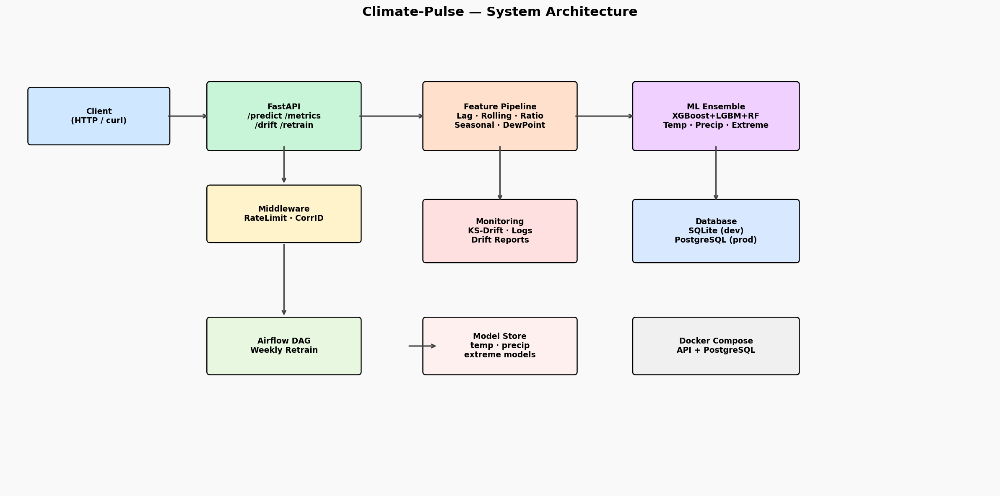

# Climate-Pulse

[](https://github.com/atharvadevne123/Climate-Pulse/actions/workflows/ci.yml)
[](https://python.org)
[](LICENSE)
[](https://github.com/atharvadevne123/Climate-Pulse/actions)
[](https://github.com/astral-sh/ruff)

**Short-range climate pattern and extreme weather event prediction API using XGBoost-LightGBM ensemble with atmospheric feature engineering, KS-drift monitoring, and Airflow retraining pipelines.**

---

## Overview

Climate-Pulse is a production-ready ML system that predicts next-step temperature, precipitation amounts, and extreme weather event probability (heatwaves, frost events, heavy precipitation) from atmospheric observations.

### Key Capabilities

- **10 REST endpoints** under `/api/v1/` for prediction, drift monitoring, retraining, and observability
- **XGBoost + LightGBM + RandomForest ensemble** for temperature, precipitation, and extreme-event classification
- **5-stage feature pipeline**: lag features (3 steps), rolling stats (3/7/14 windows), atmospheric ratios (humidity-pressure ratio, wind chill), seasonal sine/cosine encoding, dew-point calculation
- **5-fold cross-validation** with R² for regression targets and AUC-ROC for extreme event detection
- **KS-test drift detection** per feature column with DB-backed reports
- **Airflow weekly retraining DAG** with R²/AUC quality gates
- **Docker + PostgreSQL** production setup
- **65+ pytest tests** across 4 test modules

---

## Architecture



---

## Quick Start

### Local (SQLite)

```bash
git clone https://github.com/atharvadevne123/Climate-Pulse
cd Climate-Pulse
pip install -r requirements.txt
cp .env.example .env
uvicorn app.main:app --reload
```

### Docker (PostgreSQL)

```bash
docker-compose up --build
```

API available at `http://localhost:8000`

---

## API Reference

### `POST /api/v1/predict`

Predict next-step temperature, precipitation, and extreme event probability.

**Request:**
```json
{
  "station_id": "STATION_001",
  "temperature": 22.5,
  "precipitation": 3.2,
  "humidity": 65.0,
  "pressure": 1012.5,
  "wind_speed": 18.0,
  "cloud_cover": 40.0,
  "month": 6.0,
  "day_of_year": 160.0
}
```

**Response:**
```json
{
  "predicted_temp": 23.1,
  "predicted_precip": 2.8,
  "extreme_event_prob": 0.0312,
  "model_version": "1.0.0",
  "correlation_id": "abc-123",
  "station_id": "STATION_001"
}
```

### `GET /api/v1/health`

Health check.

### `GET /api/v1/metrics`

Returns latest 5-fold CV metrics (R², AUC-ROC, training sample count).

### `POST /api/v1/drift`

KS-test between two distributions.

### `GET /api/v1/drift/features?feature=temperature`

Drift detection on recent prediction logs for a named feature.

### `POST /api/v1/retrain`

Trigger model retraining on refreshed data; returns updated CV metrics.

### `GET /api/v1/predictions/recent?limit=20`

Fetch recent prediction logs.

### `GET /api/v1/drift/history?limit=20`

Retrieve recent drift detection reports (feature name, KS statistic, p-value, drift flag).

### `GET /api/v1/version`

Returns `{"api_version": "1.0.0", "model_version": "1.0.0"}`.

### `GET /api/v1/readyz`

Kubernetes readiness probe — returns `{"status": "ready"}` when models are loaded.

---

## Feature Engineering Pipeline

| Stage | Transformer | Output Features |
|-------|------------|-----------------|
| 1 | `LagFeatureTransformer` | temp_lag_1/2/3, precip_lag_1/2/3 |
| 2 | `RollingStatsTransformer` | temp_roll_mean/std (3,7,14), precip_roll_sum (3,7,14) |
| 3 | `AtmosphericRatioTransformer` | humidity_pressure_ratio, wind_chill |
| 4 | `SeasonalEncodingTransformer` | month_sin, month_cos, doy_sin, doy_cos |
| 5 | `DewiPointTransformer` | dew_point |
| 6 | `StandardScaler` | scaled features |

---

## Testing

```bash
# Run all tests
pytest tests/ -v

# Run with coverage report
pytest tests/ --cov=app --cov-report=term-missing --cov-fail-under=75

# Run specific test module
pytest tests/test_api.py -v
pytest tests/test_model.py -v
```

The test suite includes:
- `test_api.py`, `test_api_extended.py` — endpoint happy paths and edge cases
- `test_model.py`, `test_model_extended.py` — training, prediction, ensemble tests
- `test_features.py` — feature pipeline and transformer unit tests
- `test_monitoring.py` — drift detection and prediction logging
- `test_database.py` — ORM model CRUD tests
- `test_cache.py` — TTL cache behavior
- `test_validators.py` — input validation

## Development

```bash
make install   # install dependencies
make test      # run pytest with coverage
make lint      # ruff check + format check
make run       # start dev server
make diagram   # regenerate architecture diagram
```

---

## Project Structure

```
Climate-Pulse/
├── app/
│   ├── main.py          # FastAPI app, middleware, endpoints
│   ├── model.py         # Ensemble ML training and prediction
│   ├── features.py      # Feature engineering pipeline
│   ├── monitoring.py    # KS-drift detection, prediction logging
│   └── database.py      # SQLAlchemy models and session
├── pipelines/
│   └── retrain_dag.py   # Airflow weekly retraining DAG
├── tests/               # pytest suite (65+ tests)
├── scripts/
│   └── generate_diagram.py
├── screenshots/
│   └── architecture.png
├── .github/workflows/ci.yml
├── Dockerfile
├── docker-compose.yml
├── requirements.txt
└── .env.example
```
